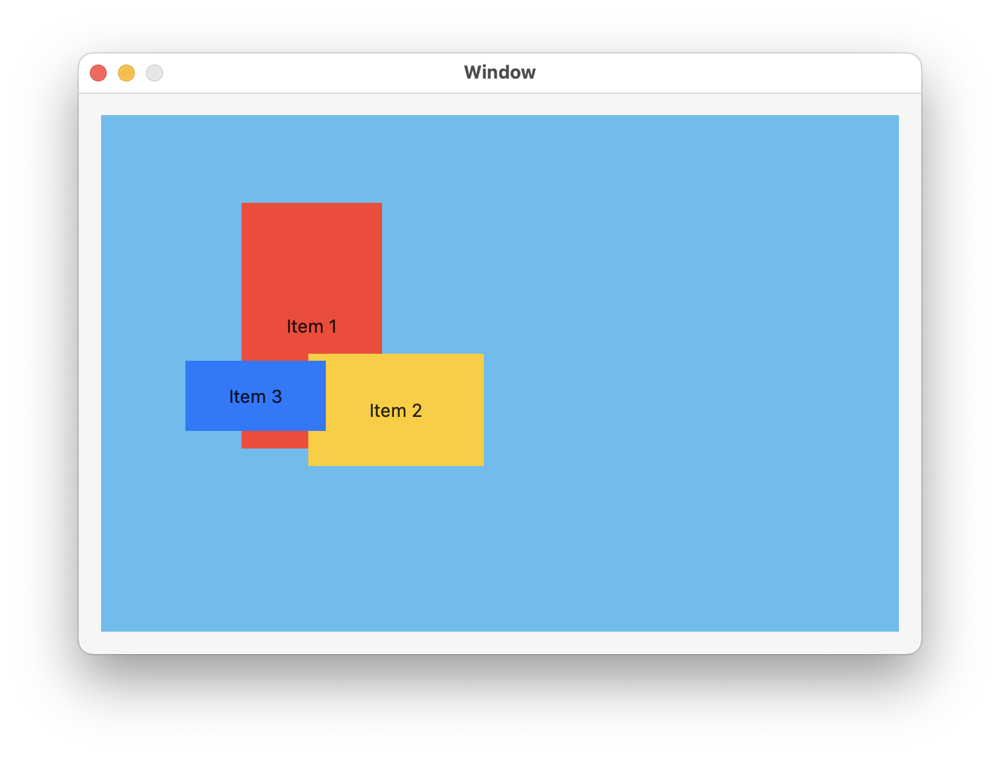
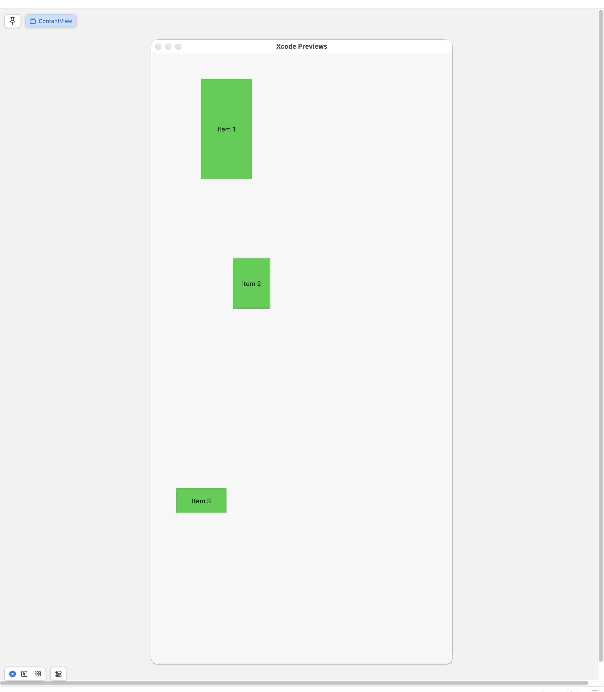
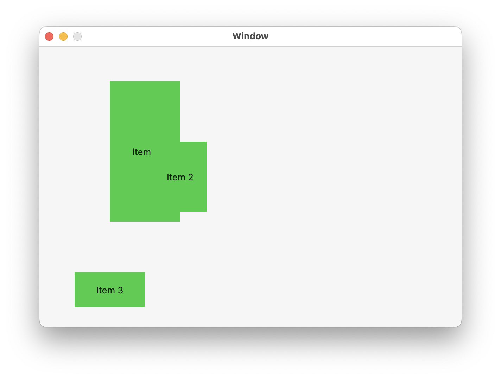

#  Repositionable SwiftUI Views

This project is an attempt to implement an elegant SwiftUI container that allows the user to
reposition and resize the subviews contained within it using drag gestures.



Right now I’m trying to add the drag gesture to allow repositioning the items, but I can’t modify the immutable items. I think I need some kind of Binding here, but I’m not yet sure how to set that up.

It should work like this:

```swift
struct
Item : Identifiable, RepositionableItem
{
    let id                                  =   UUID()
    var name            :   String
    var color           :   Color
    var position        :   CGPoint
    var size            :   CGSize
    
    static
    let
    testItems: [Item] =
    [
        Item(name: "Item 1", color: .red, position: CGPoint(x: 150, y: 150), size: CGSize(width: 100, height: 175)),
        Item(name: "Item 2", color: .yellow, position: CGPoint(x: 210, y: 210), size: CGSize(width: 125, height: 80)),
        Item(name: "Item 3", color: .blue, position: CGPoint(x: 110, y: 200), size: CGSize(width: 100, height: 50)),
    ]
}


struct
ItemView : View
{
    let item            :   Item
    
    var
    body: some View
    {
        ZStack
        {
            self.item.color
            Text("\(self.item.name)")
        }
    }
}

struct
ContentView: View
{
    var
    body: some View
    {
        RepositionableItemContainer(Item.testItems)
        { inItem in
            ItemView(item: inItem)
        }
        .padding()
        .frame(width: 600, height: 400)
    }
}
```

## Xcode Issues

The preview size is set to 600x400. But the preview is decidedly *not* that size, and it’s positioning the subviews incorrectly. This was solved by adding `.frame(maxWidth: .infinity, maxHeight: .infinity)`,
not sure why.




